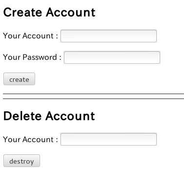
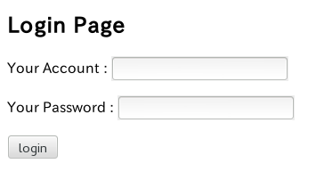

Sails Auth Sample
=======

This is auth_sample using sails.

  - node.js
  - websocket.io
  - sails
  - passport
  - bcrypt


Creation of  project
--------------

```sh
sails new auth_sample
```


Addition of  network I/F function 
--------------

generate auth controller

```sh
sails generate controller auth login logout process
```
api/controllers/AuthController.js
```sh
var passport    = require('passport');

//helper functions
function findById(id, fn) {  
    User.findOne(id).exec(function (err, user) {
        if (err) {
            return fn(null, null);
        } else {
            return fn(null, user);
        }
    });
}

function findByUsername(u, fn) {  
    User.findOne({
        username: u
    }).exec(function (err, user) {
        // Error handling
        if (err) {
            return fn(null, null);
        // The User was found successfully!
        } else {
            return fn(null, user);
        }
    });
}


module.exports = {

	/**
	 * /auth/login
	 */
	login: function(req, res) {
		
		sails.log.debug('/auth/login');
		res.view({'result': null});
	},

	/**
	 * /auth/logout
	 */
	logout: function(req, res) {

		req.session.user = null ;
		req.session.authenticated = null;
		req.logout();
		res.view('auth/login', {'result':null});
	},

	/**
	 * process
	 */
	process: function(req,res){
		sails.log.debug('/auth/process');

		passport.authenticate('local', function(err, user, info){
			sails.log.debug('passporrt.auth err :' + err);
			sails.log.debug('passport.auth user:' + JSON.stringify(user));	
			sails.log.debug('passport.auth info:' + JSON.stringify(info));


			if ((err) || (!user)) {
				return res.view('auth/login', {'result':'error', 'detail':info['message']});
			}
			req.logIn(user, function(err){
				sails.log.debug('login err : ' + err);
				if (err) {
					return res.view('auth/login', {'result':'error', 'detail':JSON.sytringify(err)});
				}
				// to mypage
				req.session.userid = user[0].id;
				req.session.user = user[0].username;
				req.session.authenticated = true;
				return res.view('mypage/index', {'username':user[0].username});
			});
		})(req, res);
	},

	/**
	* Overrides for the settings in `config/controllers.js`
	* (specific to AuthController)
	*/
	_config: {}
}
```
views/auth/login.ejs
```sh
<!DOCTYPE html>

<h2>Login Page</h2>

<% if (result == 'error') { %>
	<h3>
	<%= detail %>
	</h3>
<% } %>


<form action='/auth/process' method='post'>
	<p>Your Account : <input type='text' name='username' valu='test@example.com' size='20'/></p>
	<p>Your Password : <input type='password' name='password'  size='20' /></p>
	<p><input type='submit' name='submit' value='login' /></p>
</form>
```

generate mypage controller
```sh
sails generate controller mypage index subpage
```

api/controllers/MypageController.js

```sh
/**
 * /mypage/index
 */
index: function(req, res) {

	User.find({
    	id : req.session.userid
	}).done(function(err, user) {
		if (err) {
			// 
			sails.log.error('err : ' + err); 
		}
		if (!user) {
			sails.log.error('user : ' + user);
		}
		sails.log.debug('user: ' + JSON.stringify(user));
		res.view({'username': user[0]['username']});
	});
},

/**
 * /mypage/subpage
 */
subpage: function(req, res) {
	res.view();
},

```
views/mypage/index.ejs
```sh
<h1>Welcome <%= username %> </h1>
<a href="/mypage/subpage">subpage</a>
<a href="/auth/logout">logout</a>
```

views/mypage/subpage.ejs
```sh
<h1>subpage</h1>
<a href="/mypage/index">to top mypage</a>
```


add police

policies/isAuthenticated.ejs
```sh
module.exports = function(req, res, next) {

	// User is allowed, proceed to the next policy, 
	// or if this is the last policy, the controller
	if (req.session.authenticated) {
		
		// invalid session cache
		res.header('Cache-Control', 'private, no-cache, no-store, must-revalidate');
		res.header('Expires', '-1');
		res.header('Pragma', 'no-cache');

		return next();
	}
	
	// User is not allowed
	// (default res.forbidden() behavior can be overridden in `config/403.js`)
	return res.forbidden('You are not permitted to perform this action.');
};
```

add config

config/passport.js
```sh
var passport = require('passport');
var LocalStrategy = require('passport-local').Strategy;
var bcrypt = require('bcrypt');

passport.serializeUser(function(user, done) {
	done(null, user[0].id);
});

passport.deserializeUser(function(id, done) {
	User.findById(id, function (err, user) {
		done(err, user);
	});
});

passport.use(new LocalStrategy(
	function(username, password, done) {
		User.findByUsername(username).done(function(err, user) {
	 		
			if (err) { 
				return done(null, err);
			}
			if (!user || user.length < 1) {
				return done(null, false, { message: 'Incorrect User'});
			}
			
			bcrypt.compare(password, user[0].password, function(err, res) {
				if (!res) {
					return done(null, false, { message: 'Invalid Password'});
				}
				return done(null, user);
			});
		});
	})
);

module.exports = {
	express: {
		customMiddleware: function(app) {
			console.log('express midleware for passport');
			app.use(passport.initialize());
			app.use(passport.session());
		}
	},		
};

```


generate user controller and model
```sh
sails generate user
```

api/model/User.js
```sh
var bcrypt = require('bcrypt');

module.exports = {

	attributes: {
		username: {
			type: 'string',
			required: true,
			unique: true
		},
		password: {
			type: 'string',
			required: true
		},
		
		/**
		 * override toJson
		 * remove password from API
	 	*/
		toJSON: function() {
			var obj = this.toObject();
			delete obj.password;
			return obj;
		},

	},

	/**
	 * override beforeCreate
	 * encrypt user password
	 */	
	beforeCreate: function(user, cb) {

		bcrypt.genSalt(10, function(err, salt) {
			bcrypt.hash(user.password, salt, function(err, hash) {
				if (err) {
					console.log(err);
					cb();
				} else {
					user.password = hash;
					cb(null, user);
				}
			});
		});
	},
};
```


api/controllers/UserController.js
```sh
/**
	 * account management view
	 * /user/manage
	 */
	manage: function(req, res) {
		sails.log.debug('user/manage');
		res.view({});
	},

	/**
	 * create user account
	 * user/create
	 */
	create: function(req, res) {
		console.log('/user/create');

		User.create({
			username: req.param('username'),
			password: req.param('password')
		}).done(function(err, user) {
			if (err) {
				// do not need '/'
				// object or array だけjsonにする？
				return res.view('user/result', {'src':'create', 'result':'error', 'detail':JSON.stringify(err)});
			}
			return res.redirect('/auth/login');
		});
	},

	/**
	 * delete user account
	 * /user/destroy
	 */
	destroy: function(req, res) {
		sails.log.debug('/user/destroy');
		
		User.destroy({
			username: req.param('username')
		}).done(function(err) {	
			if (err) {
				return res.view('user/result', {'src':'destory', 'result':'error', 'detail':JSON.stringify(err)});
			}
			return res.view('user/result', {'src':'destroy', 'result':'success'});
		});
	},
   
	/**
	 * action result view
	 * /user/result
	 */
	result: function(req, res) {
		console.log('user/result');
		res.view({});
	},	

```

views/user/manage.ejs
```sh
<!DOCTYPE html>
<h2>Create Account</h2>

<form action='/user/create' method='post'>
	<p>Your Account : <input type='text' name='username' valu='test@example.com' size='20'/></p>
	<p>Your Password : <input type='password' name='password'  size='20' /></p>
	<p><input type='submit' name='submit' value='create' /></p>
</form>

<hr>
<hr>


<h2>Delete Account</h2>

<form action='/user/destroy' method='post'>
	<p>Your Account : <input type='text' name='username' valu='test@example.com' size='20'/></p>
	<p><input type='submit' name='submit' value='destroy' /></p>
</form>
```

views/user/result.ejs
```sh
<h2><%= result %></h2>

<% if('error' == result) { %>
	<p><%= detail %></p>
<% } %>

<a href='../user/manage'>To account manage page</a>
```


Starting
----
```js
sails lift
```
or

```js
node app.js
```

acccess to http://127.0.0.1:1337/auth_sample/user/manager


acccess to http://127.0.0.1:1337/auth_sample/auth/login


http://127.0.0.1:1337/auth_sample/mypage/index


License
----

MIT
